# Conduit — System Design

Clinical call triage: Twilio voice → Whisper transcription → LLM urgency classification → real-time physician dashboard.

---

## 1. Overview

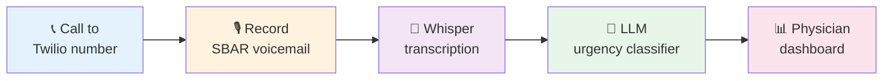
```mermaid
flowchart LR
    A["📞 Call to<br/>Twilio number"] --> B["🎙️ Record<br/>SBAR voicemail"]
    B --> C["📝 Whisper<br/>transcription"]
    C --> D["🧠 LLM<br/>urgency classifier"]
    D --> E["📊 Physician<br/>dashboard"]

    style A fill:#e3f2fd
    style B fill:#fff3e0
    style C fill:#f3e5f5
    style D fill:#e8f5e9
    style E fill:#fce4ec
```

---

## 2. Why LLM Classification?

Research shows LLMs can effectively classify urgency from unstructured natural language — the same messy, conversational input found in clinical voicemails.

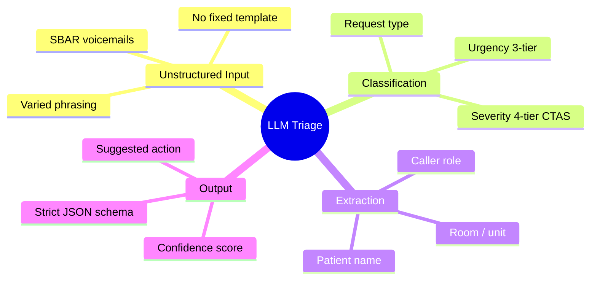
```mermaid
mindmap
  root((LLM Triage))
    Unstructured Input
      SBAR voicemails
      No fixed template
      Varied phrasing
    Classification
      Urgency 3-tier
      Severity 4-tier CTAS
      Request type
    Extraction
      Patient name
      Room / unit
      Caller role
    Output
      Strict JSON schema
      Confidence score
      Suggested action
```

---

## 3. System Context

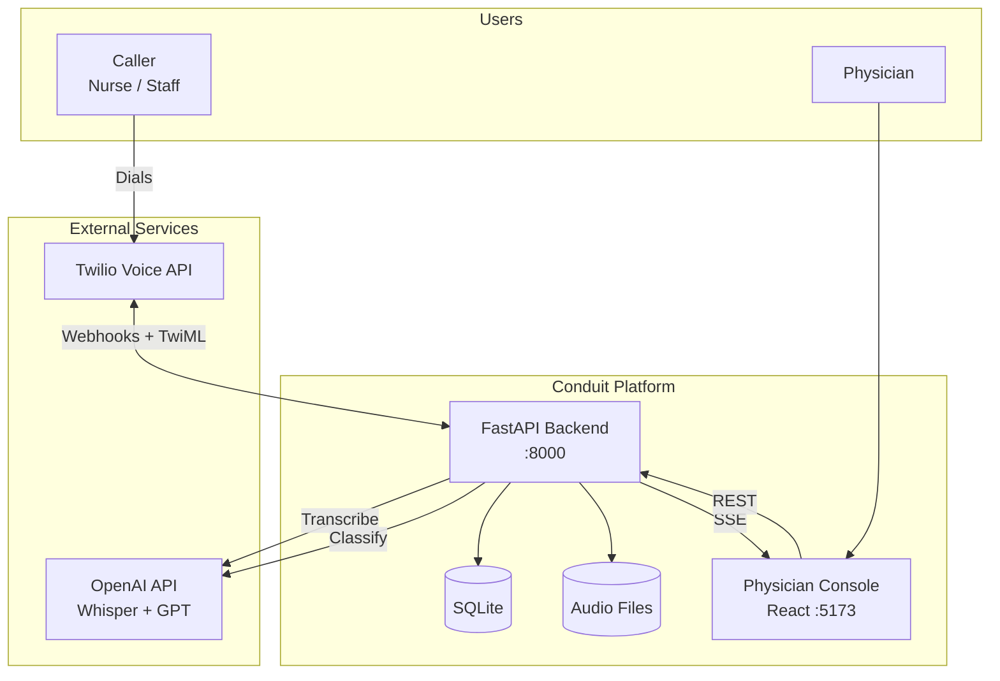
```mermaid
flowchart TB
    subgraph Users
        Caller["Caller<br/>Nurse / Staff"]
        Physician["Physician"]
    end

    subgraph Conduit["Conduit Platform"]
        Backend["FastAPI Backend<br/>:8000"]
        Frontend["Physician Console<br/>React :5173"]
        DB[(SQLite)]
        Audio[(Audio Files)]
    end

    subgraph External["External Services"]
        Twilio["Twilio Voice API"]
        OpenAI["OpenAI API<br/>Whisper + GPT"]
    end

    Caller -->|"Dials"| Twilio
    Twilio <-->|"Webhooks + TwiML"| Backend
    Backend -->|"Transcribe"| OpenAI
    Backend -->|"Classify"| OpenAI
    Backend --> DB
    Backend --> Audio
    Backend -->|"SSE"| Frontend
    Physician --> Frontend
    Frontend -->|"REST"| Backend
```

---

## 4. End-to-End Sequence

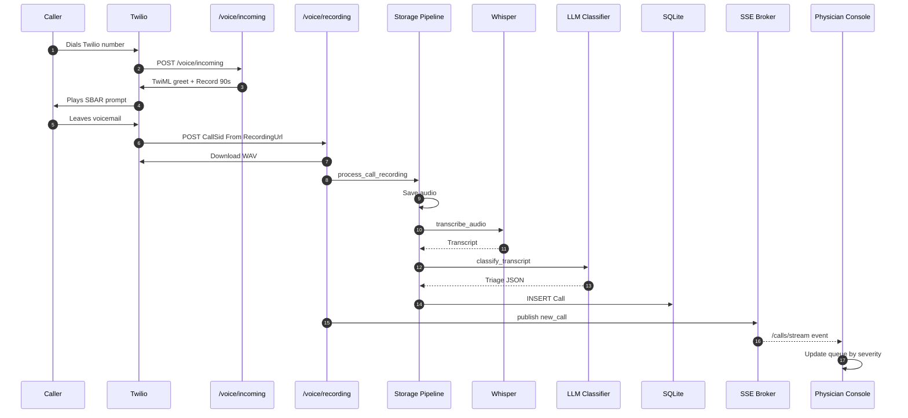
```mermaid
sequenceDiagram
    autonumber
    participant C as Caller
    participant T as Twilio
    participant V as /voice/incoming
    participant R as /voice/recording
    participant S as Storage Pipeline
    participant W as Whisper
    participant L as LLM Classifier
    participant DB as SQLite
    participant SSE as SSE Broker
    participant UI as Physician Console

    C->>T: Dials Twilio number
    T->>V: POST /voice/incoming
    V->>T: TwiML greet + Record 90s
    T->>C: Plays SBAR prompt
    C->>T: Leaves voicemail
    T->>R: POST CallSid From RecordingUrl
    R->>T: Download WAV
    R->>S: process_call_recording
    S->>S: Save audio
    S->>W: transcribe_audio
    W-->>S: Transcript
    S->>L: classify_transcript
    L-->>S: Triage JSON
    S->>DB: INSERT Call
    R->>SSE: publish new_call
    SSE-->>UI: /calls/stream event
    UI->>UI: Update queue by severity
```

---

## 5. Detailed Architecture

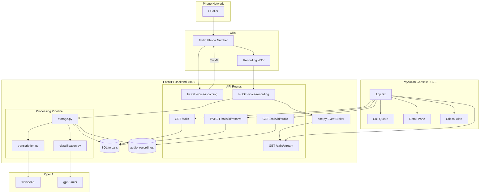
```mermaid
flowchart TB
    subgraph Phone["Phone Network"]
        CallerPhone["📞 Caller"]
    end

    subgraph TwilioCloud["Twilio"]
        TwilioNumber["Twilio Phone Number"]
        TwilioRecord["Recording WAV"]
    end

    subgraph Backend["FastAPI Backend :8000"]
        direction TB

        subgraph Routes["API Routes"]
            VoiceIncoming["POST /voice/incoming"]
            VoiceRecording["POST /voice/recording"]
            CallsAPI["GET /calls"]
            CallsStream["GET /calls/stream"]
            CallsAudio["GET /calls/id/audio"]
            CallsResolve["PATCH /calls/id/resolve"]
        end

        subgraph Services["Processing Pipeline"]
            Storage["storage.py"]
            Transcription["transcription.py"]
            Classification["classification.py"]
        end

        SSEBroker["sse.py EventBroker"]
        DB[(SQLite calls)]
        AudioDir[("audio_recordings/")]
    end

    subgraph OpenAI["OpenAI"]
        Whisper["whisper-1"]
        GPT["gpt-5-mini"]
    end

    subgraph Dashboard["Physician Console :5173"]
        App["App.tsx"]
        CallQueue["Call Queue"]
        DetailPane["Detail Pane"]
        CriticalAlert["Critical Alert"]
    end

    CallerPhone --> TwilioNumber
    TwilioNumber --> VoiceIncoming
    VoiceIncoming -->|"TwiML"| TwilioNumber
    TwilioNumber --> TwilioRecord
    TwilioRecord --> VoiceRecording

    VoiceRecording --> Storage
    Storage --> AudioDir
    Storage --> Transcription --> Whisper
    Storage --> Classification --> GPT
    Storage --> DB
    VoiceRecording --> SSEBroker --> CallsStream

    App --> CallsAPI --> DB
    App --> CallsStream
    App --> CallsAudio --> AudioDir
    App --> CallsResolve --> DB
    App --> CallQueue
    App --> DetailPane
    App --> CriticalAlert
```

---

## 6. Voice Call Flow

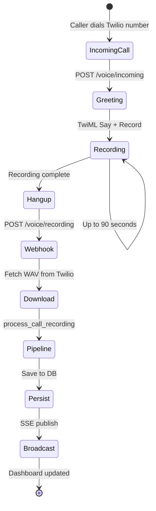
```mermaid
stateDiagram-v2
    [*] --> IncomingCall: Caller dials Twilio number

    IncomingCall --> Greeting: POST /voice/incoming
    Greeting --> Recording: TwiML Say + Record
    Recording --> Recording: Up to 90 seconds
    Recording --> Hangup: Recording complete

    Hangup --> Webhook: POST /voice/recording
    Webhook --> Download: Fetch WAV from Twilio
    Download --> Pipeline: process_call_recording
    Pipeline --> Persist: Save to DB
    Persist --> Broadcast: SSE publish
    Broadcast --> [*]: Dashboard updated
```

---

## 7. Processing Pipeline

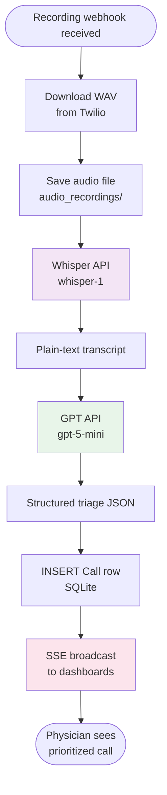
```mermaid
flowchart TD
    Start(["Recording webhook received"]) --> Download["Download WAV<br/>from Twilio"]
    Download --> Save["Save audio file<br/>audio_recordings/"]
    Save --> Transcribe["Whisper API<br/>whisper-1"]
    Transcribe --> Transcript["Plain-text transcript"]
    Transcript --> Classify["GPT API<br/>gpt-5-mini"]
    Classify --> JSON["Structured triage JSON"]
    JSON --> Store["INSERT Call row<br/>SQLite"]
    Store --> Publish["SSE broadcast<br/>to dashboards"]
    Publish --> End(["Physician sees<br/>prioritized call"])

    style Transcribe fill:#f3e5f5
    style Classify fill:#e8f5e9
    style Publish fill:#fce4ec
```

---

## 8. LLM Classification Pipeline

Unstructured speech becomes structured triage data in two AI steps:

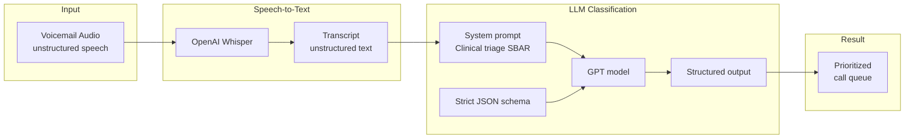
```mermaid
flowchart LR
    subgraph Input
        Audio["Voicemail Audio<br/>unstructured speech"]
    end

    subgraph STT["Speech-to-Text"]
        Whisper["OpenAI Whisper"]
        Transcript["Transcript<br/>unstructured text"]
    end

    subgraph NLP["LLM Classification"]
        Prompt["System prompt<br/>Clinical triage SBAR"]
        Schema["Strict JSON schema"]
        GPT["GPT model"]
        Output["Structured output"]
    end

    subgraph Result
        Queue["Prioritized<br/>call queue"]
    end

    Audio --> Whisper --> Transcript
    Transcript --> Prompt --> GPT
    Schema --> GPT
    GPT --> Output --> Queue
```

### Classification Output Schema

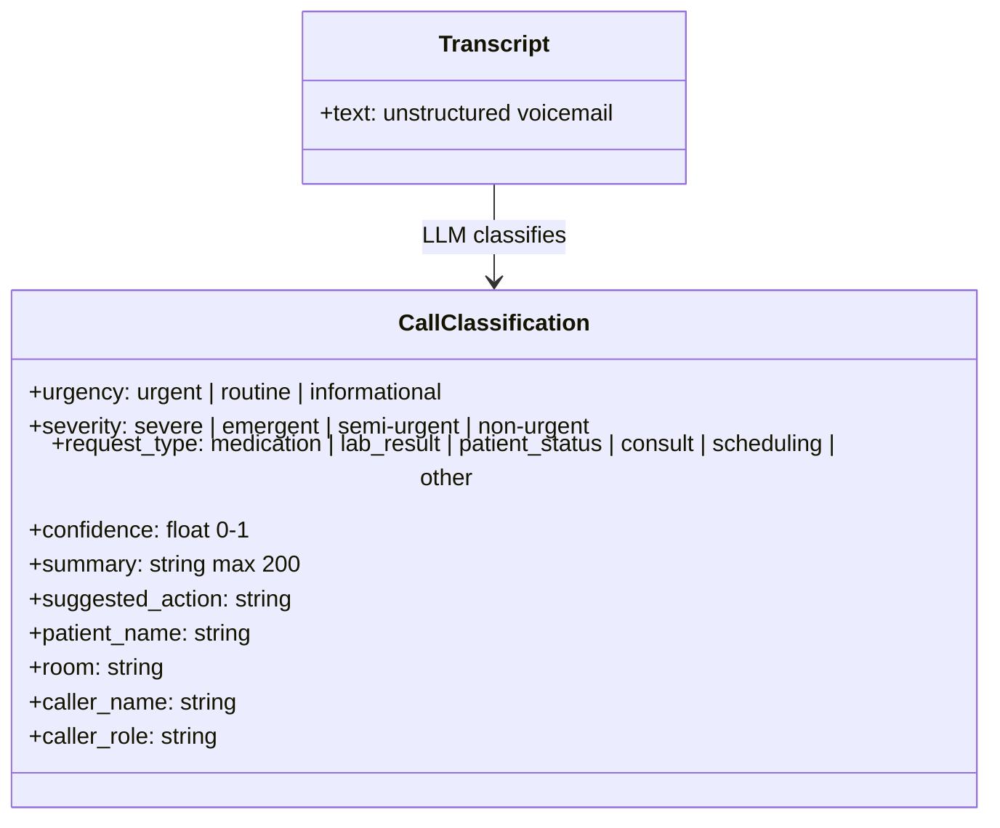
```mermaid
classDiagram
    class CallClassification {
        +urgency: urgent | routine | informational
        +severity: severe | emergent | semi-urgent | non-urgent
        +request_type: medication | lab_result | patient_status | consult | scheduling | other
        +confidence: float 0-1
        +summary: string max 200
        +suggested_action: string
        +patient_name: string
        +room: string
        +caller_name: string
        +caller_role: string
    }

    class Transcript {
        +text: unstructured voicemail
    }

    Transcript --> CallClassification : LLM classifies
```

### Severity Tiers (CTAS-style)

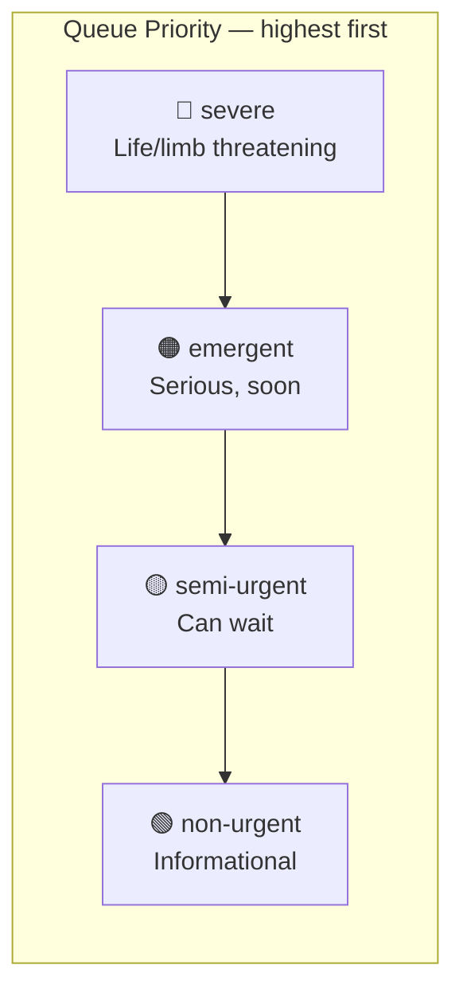
```mermaid
flowchart LR
    subgraph Severity["Queue Priority — highest first"]
        S1["🔴 severe<br/>Life/limb threatening"]
        S2["🟠 emergent<br/>Serious, soon"]
        S3["🟡 semi-urgent<br/>Can wait"]
        S4["🟢 non-urgent<br/>Informational"]
    end

    S1 --> S2 --> S3 --> S4
```

---

## 9. Data Model

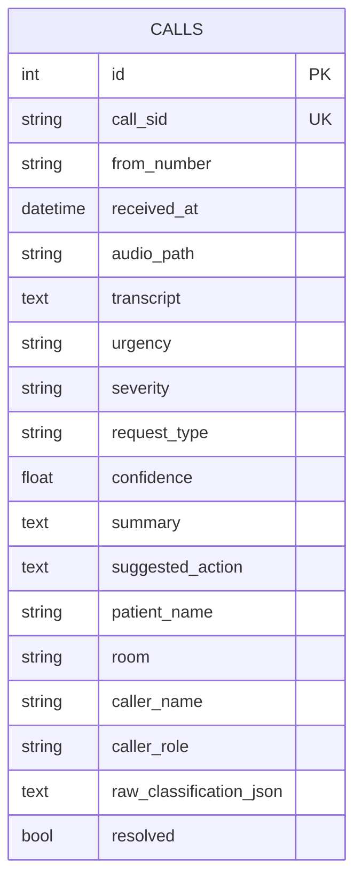
```mermaid
erDiagram
    CALLS {
        int id PK
        string call_sid UK
        string from_number
        datetime received_at
        string audio_path
        text transcript
        string urgency
        string severity
        string request_type
        float confidence
        text summary
        text suggested_action
        string patient_name
        string room
        string caller_name
        string caller_role
        text raw_classification_json
        bool resolved
    }
```

---

## 10. API Surface

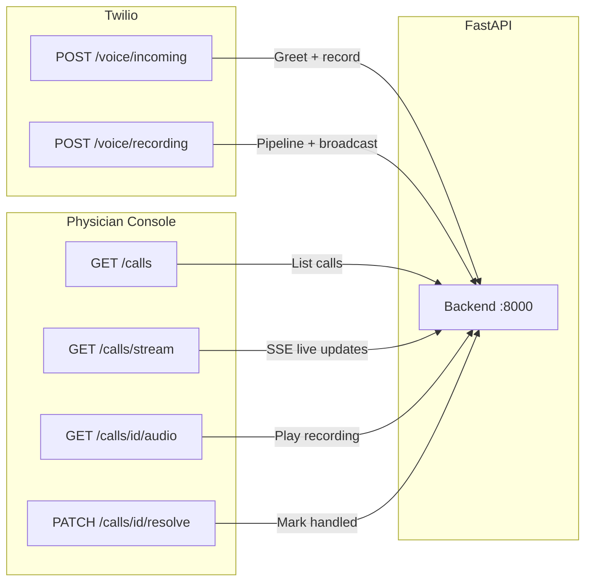
```mermaid
flowchart LR
    subgraph Twilio["Twilio"]
        T1["POST /voice/incoming"]
        T2["POST /voice/recording"]
    end

    subgraph Dashboard["Physician Console"]
        D1["GET /calls"]
        D2["GET /calls/stream"]
        D3["GET /calls/id/audio"]
        D4["PATCH /calls/id/resolve"]
    end

    subgraph Backend["FastAPI"]
        B["Backend :8000"]
    end

    T1 -->|"Greet + record"| B
    T2 -->|"Pipeline + broadcast"| B
    D1 -->|"List calls"| B
    D2 -->|"SSE live updates"| B
    D3 -->|"Play recording"| B
    D4 -->|"Mark handled"| B
```

---

## 11. Real-Time Dashboard Flow

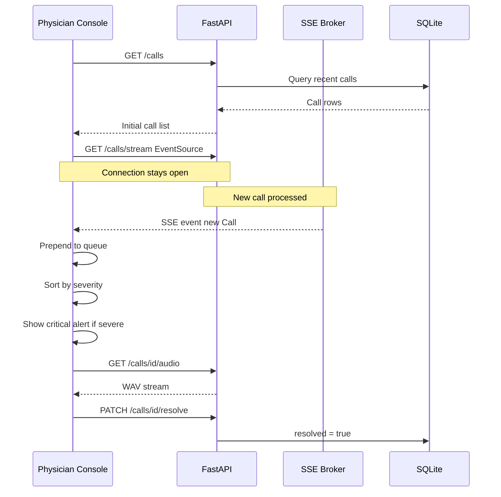
```mermaid
sequenceDiagram
    participant UI as Physician Console
    participant API as FastAPI
    participant SSE as SSE Broker
    participant DB as SQLite

    UI->>API: GET /calls
    API->>DB: Query recent calls
    DB-->>API: Call rows
    API-->>UI: Initial call list

    UI->>API: GET /calls/stream EventSource
    Note over UI,API: Connection stays open

    Note over API,SSE: New call processed
    SSE-->>UI: SSE event new Call

    UI->>UI: Prepend to queue
    UI->>UI: Sort by severity
    UI->>UI: Show critical alert if severe

    UI->>API: GET /calls/id/audio
    API-->>UI: WAV stream

    UI->>API: PATCH /calls/id/resolve
    API->>DB: resolved = true
```

---

## 12. Demo Infrastructure

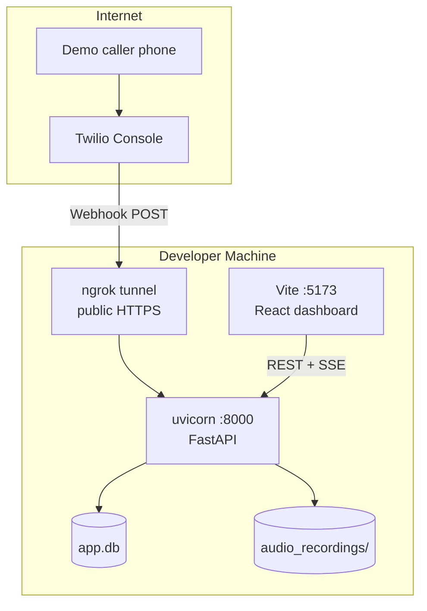
```mermaid
flowchart TB
    subgraph Internet
        TwilioConsole["Twilio Console"]
        CallerPhone["Demo caller phone"]
    end

    subgraph DevMachine["Developer Machine"]
        Ngrok["ngrok tunnel<br/>public HTTPS"]
        Uvicorn["uvicorn :8000<br/>FastAPI"]
        Vite["Vite :5173<br/>React dashboard"]
        SQLite[(app.db)]
        Files[("audio_recordings/")]
    end

    CallerPhone --> TwilioConsole
    TwilioConsole -->|"Webhook POST"| Ngrok
    Ngrok --> Uvicorn
    Uvicorn --> SQLite
    Uvicorn --> Files
    Vite -->|"REST + SSE"| Uvicorn
```

### Ports & Services

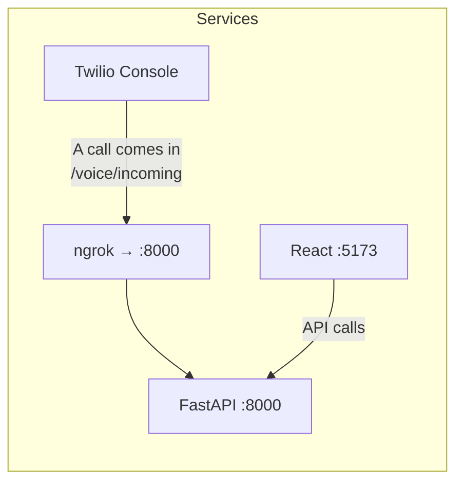
```mermaid
flowchart LR
    subgraph Services
        A["FastAPI :8000"]
        B["React :5173"]
        C["ngrok → :8000"]
        D["Twilio Console"]
    end

    D -->|"A call comes in<br/>/voice/incoming"| C
    C --> A
    B -->|"API calls"| A
```

---

## 13. Demo Recording Script

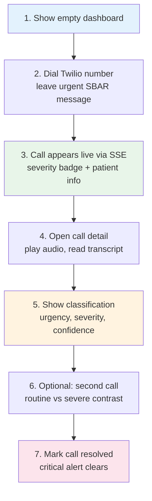
```mermaid
flowchart TD
    S1["1. Show empty dashboard"] --> S2["2. Dial Twilio number<br/>leave urgent SBAR message"]
    S2 --> S3["3. Call appears live via SSE<br/>severity badge + patient info"]
    S3 --> S4["4. Open call detail<br/>play audio, read transcript"]
    S4 --> S5["5. Show classification<br/>urgency, severity, confidence"]
    S5 --> S6["6. Optional: second call<br/>routine vs severe contrast"]
    S6 --> S7["7. Mark call resolved<br/>critical alert clears"]

    style S1 fill:#e3f2fd
    style S3 fill:#e8f5e9
    style S5 fill:#fff3e0
    style S7 fill:#fce4ec
```

---

## 14. Technology Stack

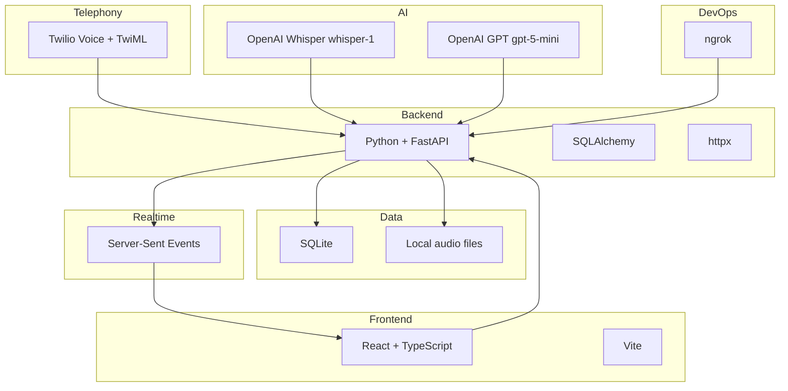
```mermaid
flowchart TB
    subgraph Telephony
        TW["Twilio Voice + TwiML"]
    end

    subgraph Backend
        PY["Python + FastAPI"]
        SA["SQLAlchemy"]
        HX["httpx"]
    end

    subgraph AI
        WH["OpenAI Whisper whisper-1"]
        GP["OpenAI GPT gpt-5-mini"]
    end

    subgraph Frontend
        RE["React + TypeScript"]
        VI["Vite"]
    end

    subgraph Data
        SQ["SQLite"]
        FS["Local audio files"]
    end

    subgraph Realtime
        SSE["Server-Sent Events"]
    end

    subgraph DevOps
        NG["ngrok"]
    end

    TW --> PY
    WH --> PY
    GP --> PY
    PY --> SQ
    PY --> FS
    PY --> SSE
    SSE --> RE
    RE --> PY
    NG --> PY
```

---

## 15. Component Map

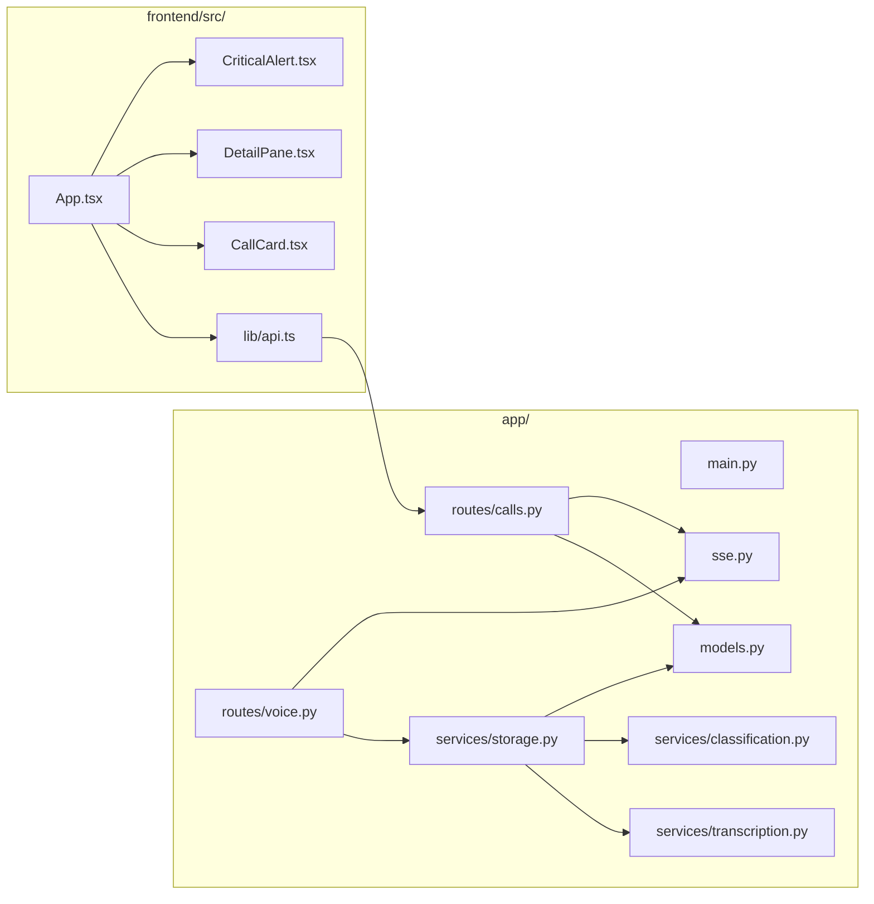
```mermaid
flowchart LR
    subgraph app/
        main["main.py"]
        voice["routes/voice.py"]
        calls["routes/calls.py"]
        storage["services/storage.py"]
        transcribe["services/transcription.py"]
        classify["services/classification.py"]
        models["models.py"]
        sse["sse.py"]
    end

    subgraph frontend/src/
        app_tsx["App.tsx"]
        api["lib/api.ts"]
        card["CallCard.tsx"]
        detail["DetailPane.tsx"]
        alert["CriticalAlert.tsx"]
    end

    voice --> storage
    storage --> transcribe
    storage --> classify
    storage --> models
    voice --> sse
    calls --> models
    calls --> sse

    app_tsx --> api
    api --> calls
    app_tsx --> card
    app_tsx --> detail
    app_tsx --> alert
```

---

## 16. Design Scope (Demo)

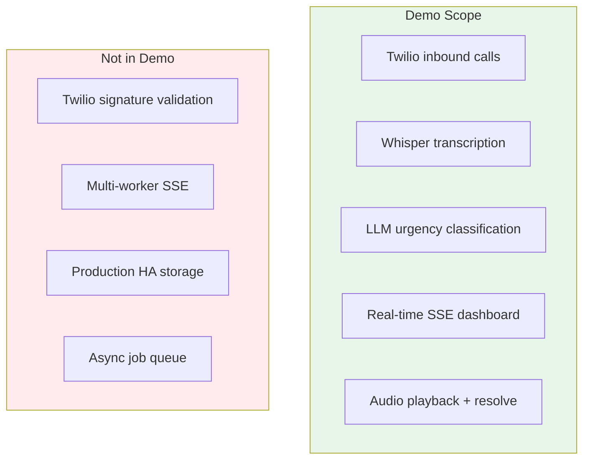
```mermaid
flowchart TD
    subgraph InScope["Demo Scope"]
        A["Twilio inbound calls"]
        B["Whisper transcription"]
        C["LLM urgency classification"]
        D["Real-time SSE dashboard"]
        E["Audio playback + resolve"]
    end

    subgraph OutOfScope["Not in Demo"]
        F["Twilio signature validation"]
        G["Multi-worker SSE"]
        H["Production HA storage"]
        I["Async job queue"]
    end

    style InScope fill:#e8f5e9
    style OutOfScope fill:#ffebee
```

---

*Conduit Clinical Call Triage Demo — diagram-first system design*
